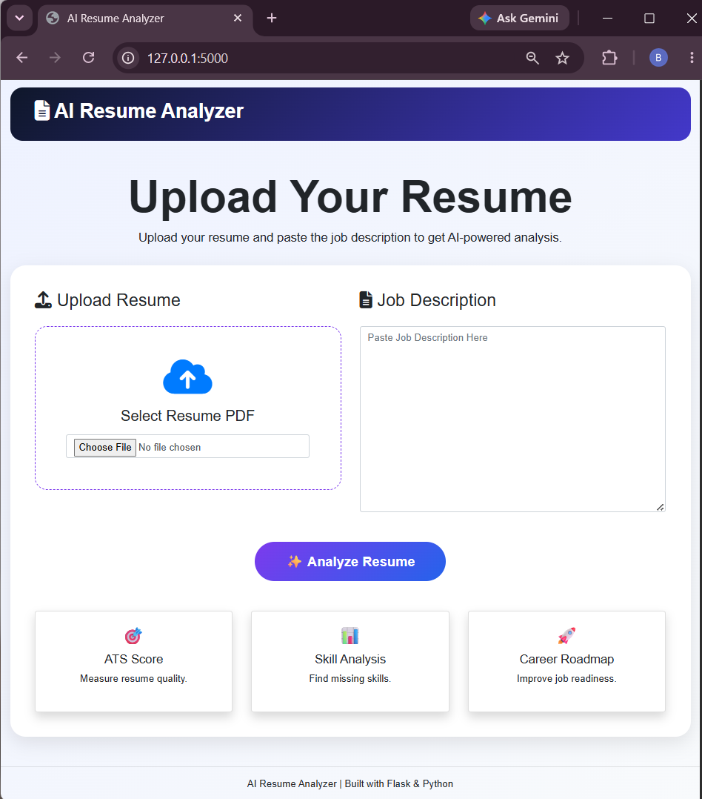
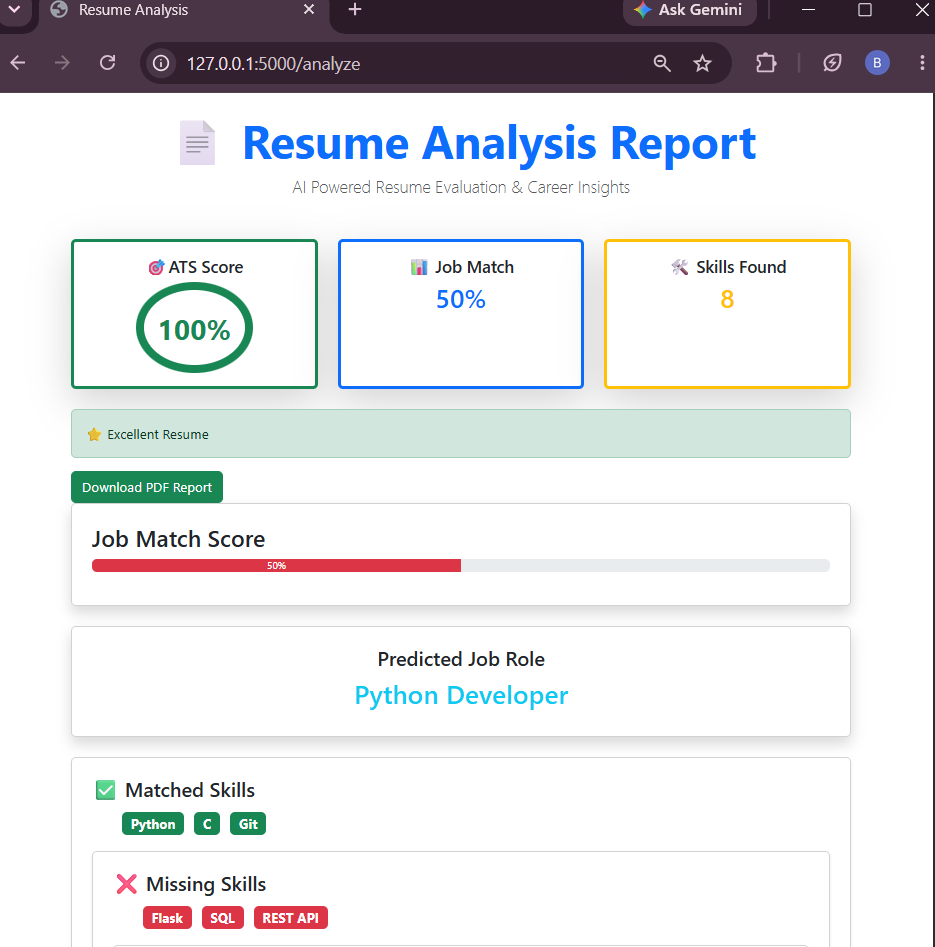
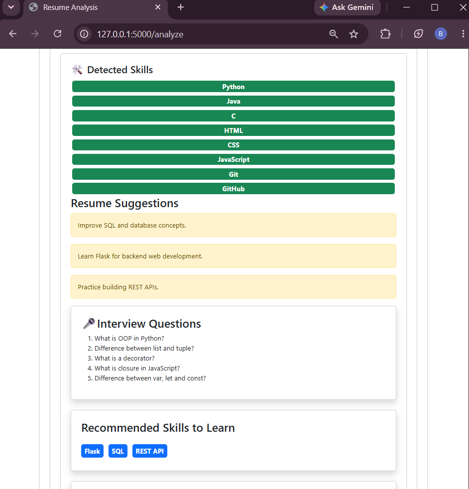
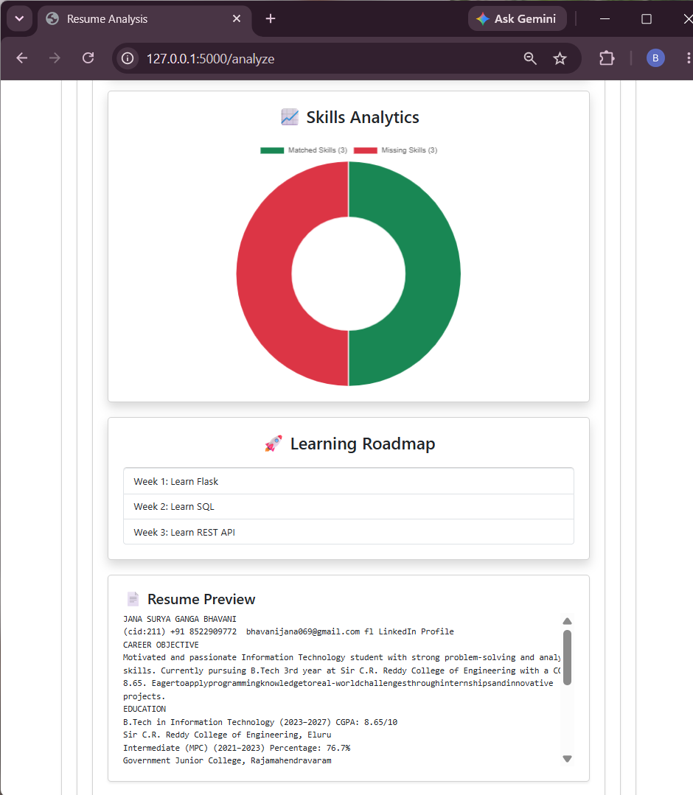

# AI Resume Analyzer

AI-powered resume analysis system built using Flask and Python.

## Features

- ATS Score Analysis
- Job Match Percentage
- Skill Gap Analysis
- Resume Suggestions
- Interview Questions
- Learning Roadmap
- Company Readiness Analysis
- Skills Analytics Chart
- PDF Report Generation

## Technologies Used

- Python
- Flask
- Bootstrap
- Chart.js
- ReportLab

## Installation

```bash
pip install -r requirements.txt
```

## Run

```bash
python app.py
```

## Screenshots

### Home Page


### Analysis Report


### Skills Analysis


### Learning Roadmap


## Author

Surya Ganga Bhavani
